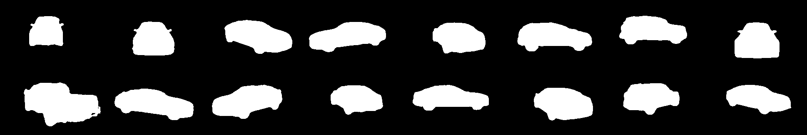

## U-Net  
实现U-Net模型用于图像语义分割，并在google colab上用Kaggle的[carvana-image-masking-challenge数据集](https://www.kaggle.com/c/carvana-image-masking-challenge)进行训练。在3个epochs后得到:  
target:  
    
predicted results:  
  

## DCGAN  
实现DCGAN模型用于人脸生成，并在google colab上用[celebA数据集](https://www.kaggle.com/dataset/504743cb487a5aed565ce14238c6343b7d650ffd28c071f03f2fd9b25819e6c9)训练。在5个epochs后得到：  
  

## seq2seq    

## credit  
Aladdin Persson https://www.youtube.com/channel/UCkzW5JSFwvKRjXABI-UTAkQ  
Hung-yi Lee https://www.youtube.com/channel/UC2ggjtuuWvxrHHHiaDH1dlQ  
gwylab http://www.seeprettyface.com/research_notes.html
