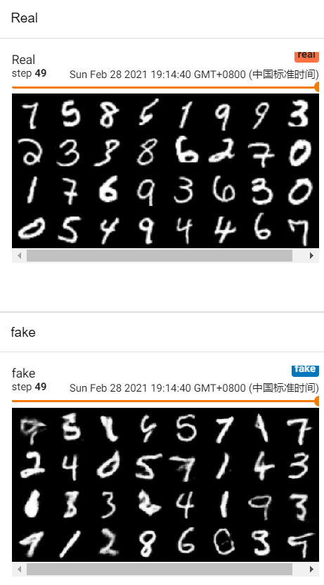

# AI实践  
## U-Net图像分割  
实现U-Net模型，并在google colab上用Kaggle的carvana-image-masking-challenge数据集进行训练。在3个epoch后得到:  
target:  
    
predicted results:  
  

## DCGAN, WGAN, WGAN-GP 
实现DCGAN模型，并在google colab上用celebA数据集训练。在5个epoch后得到：  
  
实现WGAN模型，并在google colab上用MNIST数据集训练。在5个epoch后得到：  
  
实现WGAN-GP模型，并在google colab上用MNIST数据集训练。在5个epoch后得到：  
  

## 实现RNN, seq2seq模型  
## transfer learning and fine-tuning  
fine-tune pretrained VGG16模型用于CIFAR10数据集。  
## credit  
Aladdin Persson https://www.youtube.com/channel/UCkzW5JSFwvKRjXABI-UTAkQ  
Hung-yi Lee https://www.youtube.com/channel/UC2ggjtuuWvxrHHHiaDH1dlQ  
gwylab http://www.seeprettyface.com/research_notes.html
